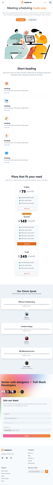

# landingpage_chakraUI

#### [Live Site](https://loremagency.netlify.app/)

# React Landing Page for Agency

A responsive landing page for an agency built with React, utilizing Chakra UI.

## Features

- Animated navbar that hides on scrolling below the hero section and reappears when scrolling above.
- Theme toggler for switching between light and dark themes.
- Responsive design for optimal viewing on various devices.
- Careers form for applicants to upload their CV and apply for positions.
- Custom scroll thumb for enhanced scrolling experience.
- Footer with a newsletter form for subscription.

## Technologies Used

- React
- Chakra UI
- Vite

## Getting Started

To run the application locally, follow these steps:

1. Clone the repository: `git clone https://github.com/your-username/agency-landing-page.git`
2. Install dependencies: `npm install`
3. Start the development server: `npm run dev`
4. Open the application in your preferred web browser.

## Usage

1. Explore the landing page and navigate through the different sections using the animated navbar.
2. Toggle between light and dark themes using the theme toggler.
3. Fill out the careers form to apply for positions at the agency by uploading your CV.
4. Scroll through the page and notice the hidden navbar behavior and the custom scroll thumb.
5. Subscribe to the newsletter by filling out the form in the footer.

## Customization

To customize the landing page for your agency, you can modify the content and styling in the provided React components. Additionally, you can leverage the flexibility of Chakra UI to further customize the design to align with your agency's branding.

## Contributing

Contributions are welcome! If you find any issues or have suggestions for improvements, please create an issue or submit a pull request.

## Acknowledgements

- Chakra UI for providing the foundational components and templates.
- Vite for the fast and efficient development environment.
